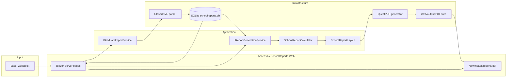

# Accessible School Report Modernizer

A 30-hour capstone that replaces a read-only SAS school-employment reporting pipeline with a local .NET 8 application. It imports a graduate Excel workbook, applies **characterized** SAS calculation rules, stores results in SQLite, and writes seven-page letter PDFs that **target** tagged PDF / PDF-UA structure while keeping the GrayscalePrinter layout.

Files under `/legacy` are the immutable characterization baseline. They are never edited.

The running app is branded as **Meridian Test Client**. It does not print NALP or ABA names.

---

## Problem

The legacy workflow is a pair of SAS 9.4 programs plus an Excel extract. School staff (or a reporting shop) preprocess graduate rows, compute counts and salary statistics, and emit one PDF per school.

That pipeline is hard to run, hard to test, and hard to use with assistive technology:

- SAS must be installed and the programs pointed at local paths.
- Business rules live in SAS `DATA` / `PROC` steps, not in automated tests.
- The ODS PDF (`STYLE=GrayscalePrinter`) is a print layout. Characterization notes that only the first school’s `ods pdf` statement used the `accessible` option (`SS-PAGE-05`); the rest omit it. The preserved baseline is not a PDF-UA validation result.
- The preserved baseline PDF (`legacy/baseline/test-school-report.pdf`) is a **Test University** artifact. It is useful for layout and value mapping. It is not an accessibility certificate, and it is not the same population as `legacy/samples/sample-export.xlsx`.

This project modernizes the **workflow** without inventing rules. Salary suppression stays `n ge 5` on non-missing full-time long-term salaries (`CF-S-00`), not on headcount.

---

## Legacy System

```text
Excel extract
    → SAS preprocessing (createschrptfiles2025.sas)
    → SAS summary / PROC REPORT (schreptsummary_2025.sas)
    → ODS PDF (GrayscalePrinter) — not a tagged-PDF product
```

| Artifact | Role |
|---|---|
| `legacy/samples/sample-export.xlsx` | Original graduate extract used as the import sample |
| `legacy/sas/createschrptfiles2025.sas` | Builds school counts, salaries, and combined report files |
| `legacy/sas/schreptsummary_2025.sas` | Formats seven `PROC REPORT` pages and writes the PDF |
| `legacy/baseline/test-school-report.pdf` | Immutable visual/value baseline (Class of 2024 / July 2025 chrome on that file) |

Characterization of those programs is in `docs/capstone/`. Ambiguous SAS behavior is recorded as skipped tests, not guessed.

---

## Modernized System

```text
Excel workbook
    → .NET 8 import (ClosedXML)
    → SQLite (EF Core)
    → report engine (calculator + layout)
    → QuestPDF tagged-PDF *target*
```

1. **Import** validates headers and rows, persists graduates and an `ImportRun`.
2. **SQLite** is the only database. The working file is `data/schoolreports.db` at the repository root.
3. **Calculator** (`SchoolReportCalculator`) applies characterized recodes, counts, percents, and salary statistics.
4. **Layout** (`SchoolReportLayout` / `SchoolReportPresentation`) maps rows onto the seven SAS page slices. Year chrome follows the 2025 SAS program (`Class of 2025`, July 2026), not the 2024 baseline artifact years.
5. **PDF** (`QuestPdfAccessiblePdfGenerator`) draws the GrayscalePrinter structure and sets PDF/UA-oriented document settings. Generation is **not** a veraPDF, PAC, or screen-reader pass.
6. **Blazor Server** UI: Dashboard, Import Data, Generate Report, Generate All, Run History. Completed PDFs download as `{schoolCode}-summary-report.pdf`.

---

## Architecture



| Project | Responsibility |
|---|---|
| `AccessibleSchoolReports.Web` | Blazor UI, download endpoints, composition root |
| `AccessibleSchoolReports.Application` | Import and generation contracts, calculator, layout, presentation |
| `AccessibleSchoolReports.Infrastructure` | ClosedXML, EF Core / SQLite, QuestPDF, run persistence |
| `AccessibleSchoolReports.Domain` | Entities, recodes, univariate helpers |

The PDF layer does not recompute business statistics. Tests that lock presentation use a hand-built `SchoolReport` fixture so a calculator change cannot silently rewrite labels.

---

## Technology Stack

| Technology | How this repo uses it |
|---|---|
| **.NET 8** | All source and test projects |
| **Blazor** | Interactive Server UI |
| **EF Core** | SQLite persistence and migrations |
| **SQLite** | Required MVP database; one working file |
| **ClosedXML** | Excel import |
| **QuestPDF** | Tagged PDF/UA-oriented generation |
| **xUnit** | Characterization, unit, and integration tests |
| **Playwright** | Used through **Playwright MCP** in Cursor sessions for browser verification and a UI accessibility *review*. It is **not** listed in `.cursor/mcp.json`, there is **no** Playwright test project, and **no** Playwright job in GitHub Actions |
| **GitHub** | Source, pull requests, and `.github/workflows/quality.yml` |
| **MCP** | GitHub MCP, Playwright MCP, and a read-only SQLite MCP script |

---

## Features

- **Excel import** — `.xlsx` only; invalid rows are recorded; a duplicate file hash is rejected.
- **Single report** — one school, one seven-page PDF, one `ReportRun`.
- **Sequential generation** — every eligible school, one at a time.
- **Parallel generation** — bounded concurrency (default 4, clamped 1–8). Sequential and parallel results are compared on extracted PDF **text**, not bytes.
- **Tagged PDF target** — seven letter pages, SAS table structure, document language/title, semantic tables, `.` for missing/suppressed values with alternative text “Not displayed.” This is a generation target, not a validation result.
- **Run history** — status, counts, duration, and download links for completed items.

---

## AI-Assisted Development

This capstone was built in **Cursor** against project rules in `.cursor/rules/`:

- `/legacy` is read-only.
- Characterize SAS before implementing. Do not invent rules.
- Salary suppression is `n ge 5` (`CF-S-00`).
- SQLite only; no extra frameworks.
- Change protocol: list files, rules, tests, and risks before behavior changes.
- Do not claim a PDF is accessible without separate validation.
- Generated PDFs must keep the baseline **layout**; accessibility work adds tags, not a new design.

Cursor agents implemented import, calculator tests, PDF layout, download fixes, and documentation. Humans approved rule changes (including the Meridian Test Client chrome) and rejected proposals that would have broken characterization.

---

## MCP

Configured or used during development:

| Server | Role in this project |
|---|---|
| **GitHub MCP** | Configured in `.cursor/mcp.json`. Used for PRs, review comments, and merge status. The token is `${env:GITHUB_PAT}`; no secret is committed. |
| **Playwright MCP** | **Not** in `.cursor/mcp.json`. Used in Cursor sessions to drive `http://localhost:5017` and to capture snapshots for `docs/accessibility/ui-accessibility-review.md`. |
| **SQLite MCP** | Configured in `.cursor/mcp.json`. `scripts/mcp-sqlite-readonly.mjs` opens `data/schoolreports.db` read-only. |

MCP is a development aid. It is not a production API and not a substitute for `dotnet test`.

---

## Quality Gates

| Gate | What it actually does |
|---|---|
| **Characterization tests** | `tests/AccessibleSchoolReports.CharacterizationTests` lock observed SAS maps in `LegacyRules` and baseline expected values. The project references **Domain only** and does **not** run `SchoolReportCalculator`. Eighteen items stay skipped because the SAS is ambiguous. Live calculator coverage is in the unit project. |
| **Unit tests** | Calculator, recodes, layout, PDF bytes/text/tags, import parser, file-access, UI formatters. PDF tests assert structure markers (`/StructTreeRoot`, `/Lang`, `pdfuaid`). They are **not** named “PDF is accessible.” |
| **Integration tests** | SQLite create/migrate, Excel import (including the sample workbook), single-school generate, sequential generate-all, parallel generate-all. |
| **GitHub Actions** | `.github/workflows/quality.yml` restores, builds Release, and runs `dotnet test` on **pushes to `main`** and on **pull requests**, excluding `LegacyModernParityTests`. Pushes to other branches do not trigger it. |
| **Legacy integrity guard** | `scripts/pre-commit.ps1` refuses commits that stage `legacy/sas`, `legacy/samples`, or `legacy/baseline`, then checks SHA-256 values in `docs/capstone/legacy-baseline.md`. |
| **Playwright accessibility testing** | **Not automated.** Playwright MCP was used for a manual UI review. Findings are listed as problems in `docs/accessibility/ui-accessibility-review.md`. That document is not a WCAG pass. There is no Playwright CI job. |

A full local `dotnet test` on the solution **fails** one integration test: `LegacyModernParityTests`. It compares Test University baseline PDF totals (100 graduates) to a school from the sample workbook (for example `23306`, 31 graduates). That is a subject mismatch. Do not change the calculator to chase those numbers. CI uses the same filter as the integration command below. Details: `evidence/test-results/parity-results.md` and `evidence/test-results/final-quality-report.md`.

A solution run **recorded on 4 September 2026** in `evidence/test-results/final-quality-report.md`: **322 passed**, **1 failed** (parity), **19 skipped**. Later commits added more unit tests; treat those totals as that report’s snapshot, not a live count.

---

## Human Review

AI output was not treated as accepted.

**Rejected change** (`docs/decisions/rejected-ai-proposals.md`): emit salary statistics when fewer than five non-missing `salftperm` values exist. That would violate `CF-S-00`. The calculator still suppresses those cells. The unit test `Salary_IsSuppressedWhenNIsBelow5` would fail if the proposal were applied.

**Pull request review** ([PR #2](https://github.com/Manju-TF/accessible-school-report-modernizer/pull/2), merged to `main`):

- Calculator, layout, and tagged-PDF targeting were accepted for the capstone merge.
- Quality CI staying red because of the parity test was called out on that PR. CI now excludes that one test; the calculator is unchanged.
- `/downloads/reports/{id}` is unauthenticated — acceptable for a local MVP, not a protected file store.
- Generated PDFs must not be described as accessible without veraPDF / PAC / screen-reader evidence.

---

## Performance

`evidence/test-results/performance-results.md` is **not in this repository**. No formal benchmark file was produced.

What the implementation does record:

- Each `ReportRun` stores `DurationMilliseconds` (shown on Run History).
- Integration tests assert that sequential and parallel generate-all complete and persist a non-negative duration.
- Sequential vs parallel is checked for equivalent PDF **text**, not for a required speedup ratio.

If a timed 189-school run is needed for the write-up, generate all schools in the UI and copy the duration from Run History into a new evidence file. Do not invent timings here.

---

## Limitations

- **PDF accessibility is not validated.** QuestPDF is configured for tagged PDF/UA-1 and PDF/A-3A. No veraPDF, PAC, Adobe checker, or NVDA/JAWS report is checked in. Do not say “the PDF is accessible.”
- **UI accessibility is reviewed, not certified.** Known issues are listed in `docs/accessibility/ui-accessibility-review.md`.
- **Scope is a local MVP.** No authentication, no multi-user hosting, no second database, no cloud deploy.
- **SQLite only.** The app resolves `Data Source=data/schoolreports.db` from the repository root. Concurrent writers can still hit SQLite locking under load.
- **Downloads are open.** Anyone who can reach the process can fetch `/downloads/reports/{itemId}`.
- **Unsupported / unguessed SAS.** Eighteen characterization tests remain skipped (ambiguous filters, formats, and title-year differences). Schools `53404` and `54703` have no `%SCHRPTS` name in SAS; the app does not invent names.
- **Baseline vs sample.** The Test University PDF and `sample-export.xlsx` are different populations. Layout is matched to the baseline; live numbers come from the imported workbook.
- **No Playwright E2E suite.** Browser checks were agent-driven, not `dotnet test`.
- **Pixel identity is not claimed.** Fonts are a Times/Thorndale stack, not embedded SAS ThorndaleAMT.

---

## Running Locally

Prerequisites: [.NET 8 SDK](https://dotnet.microsoft.com/download/dotnet/8.0), Git. Excel import needs no SAS install.

From the repository root:

```powershell
dotnet restore
dotnet build AccessibleSchoolReports.sln
dotnet run --project src/AccessibleSchoolReports.Web --launch-profile http
```

Open **http://localhost:5017**.

1. **Import Data** — choose `legacy/samples/sample-export.xlsx` (the picker can open that file; do not save changes back into `/legacy`).
2. **Generate Report** — pick a school, year `2025`, generate, then **Download PDF**.
3. **Generate All** — sequential or parallel (max 1–8).
4. **Run History** — confirm duration and downloads.
5. **Dashboard** — confirm **Working database** is `...\AccessibleSchoolReportModernizer\data\schoolreports.db`.
6. Generated files are written under `src/AccessibleSchoolReports.Web/output/{year}/{schoolCode}/summary-report.pdf`.

### Tests

```powershell
dotnet test tests/AccessibleSchoolReports.CharacterizationTests
dotnet test tests/AccessibleSchoolReports.UnitTests
dotnet test tests/AccessibleSchoolReports.IntegrationTests --filter "FullyQualifiedName!~LegacyModernParityTests"
```

Full solution (includes the known-failing parity test):

```powershell
dotnet test AccessibleSchoolReports.sln
```

### Legacy integrity hook (once per clone)

```powershell
$root = git rev-parse --show-toplevel
$hook = Join-Path $root ".git\hooks\pre-commit"
@'
#!/bin/sh
repo_root="$(git rev-parse --show-toplevel)"
powershell.exe -NoProfile -ExecutionPolicy Bypass -File "$repo_root/scripts/pre-commit.ps1"
exit $?
'@ | Set-Content -Path $hook -Encoding ascii
```

Run without committing:

```powershell
powershell -NoProfile -ExecutionPolicy Bypass -File scripts/pre-commit.ps1
powershell -NoProfile -ExecutionPolicy Bypass -File scripts/verify-legacy-integrity.ps1
```

---

## Documentation map

| Path | Contents |
|---|---|
| `docs/capstone/` | SAS analysis, business-rule IDs, report map, legacy hashes |
| `docs/architecture/` | Corrected 30-hour plan and implementation notes |
| `docs/accessibility/` | PDF targeting strategy; UI review findings |
| `docs/decisions/rejected-ai-proposals.md` | Human-rejected AI changes |
| `evidence/test-results/` | Quality report and parity results |
